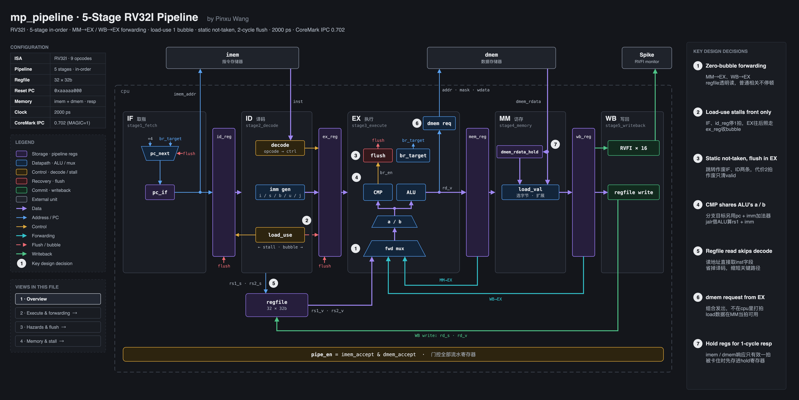
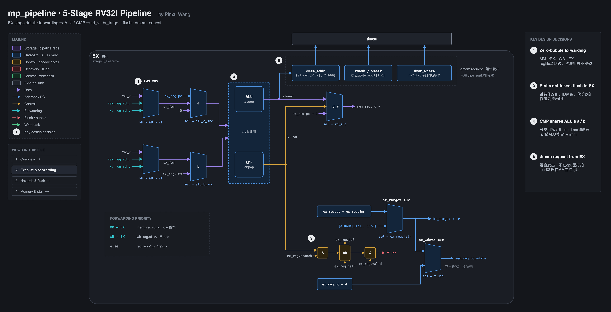
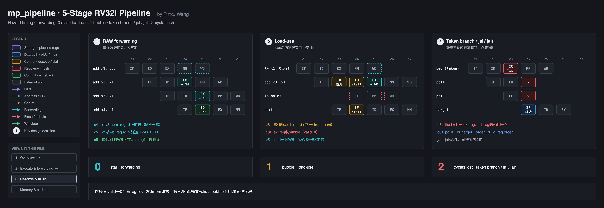
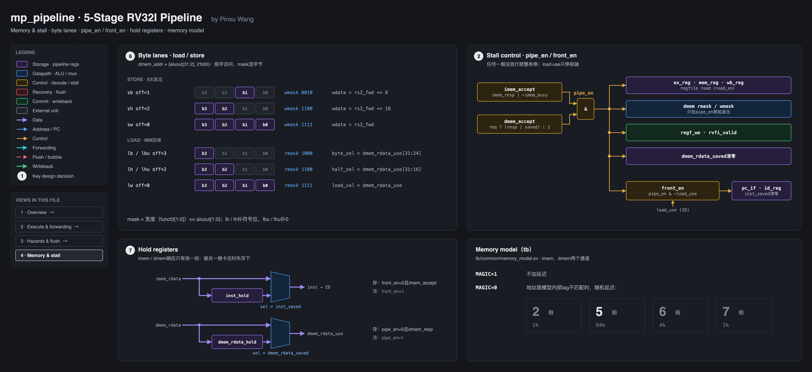
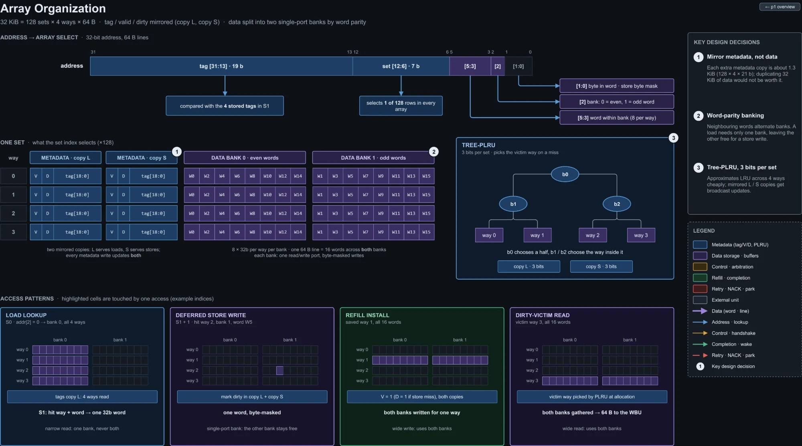
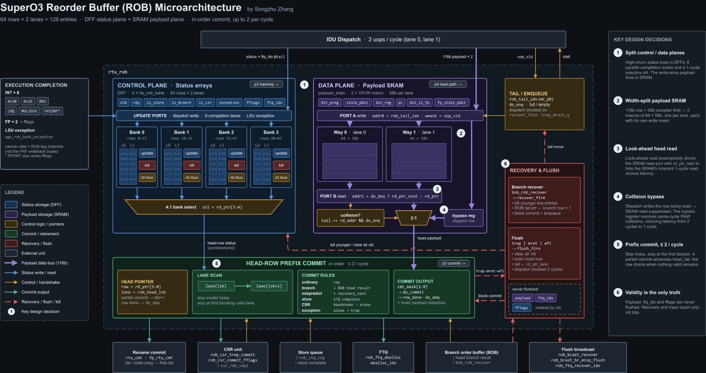
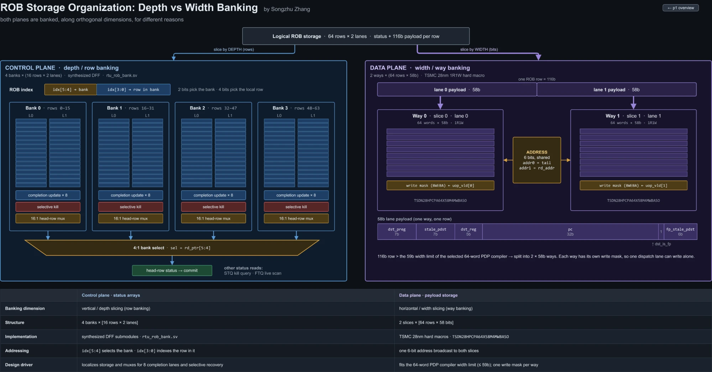

# drawio-arch-kit

用脚本画深色风格的硬件 / 软件架构图（draw.io），带一套画图规范、四步流程和两个自查脚本。
给代码助手（如Codex）用：说一句「画一下XX的架构图，代码在YY」，它按规范一口气出图。

## 样板：5级流水RV32I CPU（`examples/mp_pipeline`，4页）

<table>
<tr>
<td width="50%"></td>
<td width="50%"></td>
</tr>
<tr>
<td align="center">1 · Overview：五级流水、前递回路、写回、关键设计决策</td>
<td align="center">2 · Execute & forwarding：EX级拆开画</td>
</tr>
<tr>
<td width="50%"></td>
<td width="50%"></td>
</tr>
<tr>
<td align="center">3 · Hazards & flush：前递、load-use、跳转的逐拍时序</td>
<td align="center">4 · Memory & stall：字节通道、停顿控制、保持寄存器</td>
</tr>
</table>

## 风格参考：同学Songzhu Zhang的SuperO3架构图（`docs/ref`）

本仓库的深色风格、三栏版式、编号对应「关键设计决策」，都是照这4张图学来的。图的版权归原作者。

<table>
<tr>
<td width="50%"></td>
<td width="50%"></td>
</tr>
<tr>
<td align="center">L1 Data Cache · overview</td>
<td align="center">L1 Data Cache · array organization</td>
</tr>
<tr>
<td width="50%"></td>
<td width="50%"></td>
</tr>
<tr>
<td align="center">Reorder Buffer · overview</td>
<td align="center">Reorder Buffer · storage banking</td>
</tr>
</table>

## 目录

| 路径 | 内容 |
| --- | --- |
| `AGENTS.md` | 给代码助手的入口说明，Codex进仓库会自动读 |
| `docs/DrawIO绘图规范.md` | 画图规范：新图流程、深色风格、走线、符号、自查、踩坑 |
| `docs/DrawIO画图提示词.md` | 四步提示词原文：text → ascii → design → drawio |
| `tools/drawio_kit.py` | 生成库：配色、版式部件、导出、自查一条龙 |
| `tools/drawio_check.py` | 自查8项：斜线、线穿模块框、线压文字、框重叠、悬空引用等 |
| `tools/drawio_deep_check.py` | 补充自查：字压字、字压框、线穿编号圆、箭头悬空、线交叉、中英之间空格 |
| `tools/new_diagram.py` | 新建一张图的工作文件夹：复制上面三个工具，放一个能直接跑的起步模板 |
| `examples/mp_pipeline/` | 完整范例：三份中间文档、4页.drawio、每页PNG、生成脚本 |
| `docs/ref/` | 风格参考：同学的4张SuperO3架构图 |

## 依赖

- Python 3.8+，只用标准库
- draw.io Desktop：用它的命令行导出PNG / SVG
  - macOS：装到`/Applications`即可
  - Windows：默认路径`C:\Program Files\draw.io\draw.io.exe`
  - Linux：`drawio`在PATH上；没有图形界面时装`xvfb`，脚本会自动套`xvfb-run`
  - 装在别处：设环境变量`DRAWIO=<可执行文件路径>`

## 快速开始

```bash
python3 tools/new_diagram.py ~/proj/diagrams/my_design
cd ~/proj/diagrams/my_design
python3 gen_drawio.py --export --check      # 写 .drawio、导出每页 PNG、每页跑两个自查脚本
```

重出范例：`python3 examples/mp_pipeline/gen_drawio.py --export --check`

## 在Codex里用

1. clone到新电脑，比如`~/tools/drawio-arch-kit`
2. 在这个仓库里干活：`AGENTS.md`会被自动读到
3. 想在任何项目里都生效：把下面这行加进Codex的全局说明`~/.codex/AGENTS.md`（路径换成你clone的位置）：

   ```
   - 画 / 改任何 drawio 图：先读 ~/tools/drawio-arch-kit/docs/DrawIO绘图规范.md 并照做；工具在同仓库的 tools/
   ```

4. 然后直接说：「画一下XX的架构图，代码在YY」

## 换电脑要改的

- 署名：设`DRAWIO_AUTHOR="by 你的名字"`，或改`tools/drawio_kit.py`里的`AUTHOR`
- 字体：默认Helvetica / Menlo（macOS自带）。Windows可设`DRAWIO_SANS=Arial`、`DRAWIO_MONO=Consolas`；
  换了字体字宽会变，跑一遍`--check`再放大看图
- 自查脚本找不到：设`DRAWIO_TOOLS=<放drawio_check.py的目录>`
